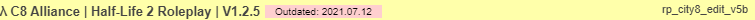

# 👾 Как начать играть?

## Требования:

* Кратко: _Garry's Mod (steam), CSS контент, контент сервера C8 Alliance (опцианально), отличное настроение!_ :tada:


CSS контент - обязателен, будет не приятно играть на 90% серверов.

Ниже вы увидете более развёрнутое описание каждого требования, вместе с ссылками на требования.


### Что требуется для игры на сервере?

1. Лицензионная копия игры [_Garry's Mod_](https://store.steampowered.com/app/4000/Garrys\_Mod/) из [_Steam_](https://store.steampowered.com), купить его можно тут: [_**https://store.steampowered.com/app/4000/Garrys\_Mod/**_](https://store.steampowered.com/app/4000/Garrys\_Mod/)__
2. CSS контент - его можно легко в интернете. (добавить ссылку на CSS контент.)
3. Контент сервера - Нажми сюда -> [КОНТЕНТ](https://steamcommunity.com/sharedfiles/filedetails/?id=1257683679). Установка довольно проста. Нужно нажать на кнопку (в русской версии STEAM - "Подписаться на всё.")

## Подключение:

* _Кратко_: Запустить \_Garry's Mod (steam), открыть консоль -> вбить: \_`connect 46.174.52.121:27015` или перейти по [https://nebulaservers.xyz/redirects/c8alliance](https://nebulaservers.xyz/redirects/c8alliance) для автоматического быстро подключения.

### Подключение по шагам:


Самый быстрый способ подключения это Fast Connect, достаточно просто нажать на [https://nebulaservers.xyz/redirects/c8alliance](https://nebulaservers.xyz/redirects/c8alliance) или [steam://connect/46.174.52.121:27015](steam://connect/46.174.52.121:27015).


Подключение через игру:

1. Запустить игру Garry's Mod.
2. Открыть консоль (по умолчанию \~ или \` или Ё кнопка.)
3. Ввести в консоль: `connect 46.174.52.121:27015`

Или:

1\. Запустить игру Garry's Mod.

2\. Нажать на .

3\. Нажать на .

4\. В поиске вбить half или Half-Life .

5\. Подождать и нажать на:

6\. Нажать на кнопку .png>)
